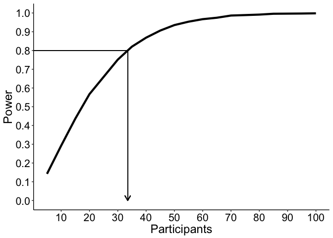
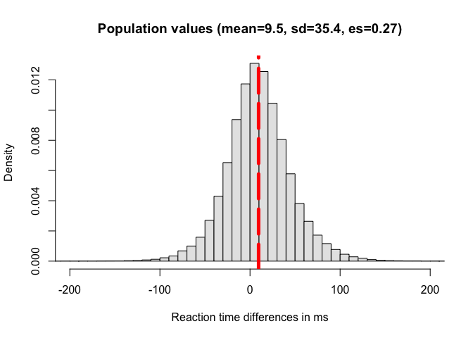
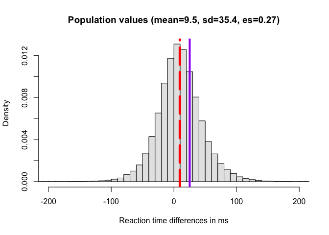
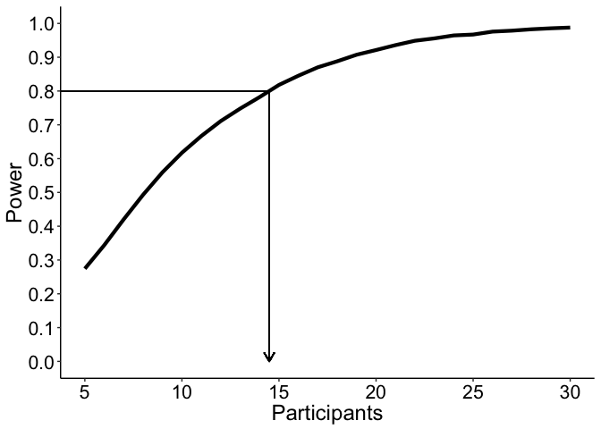
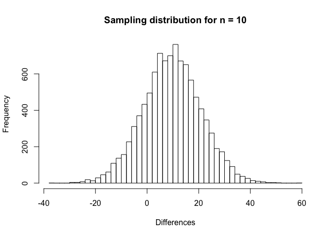
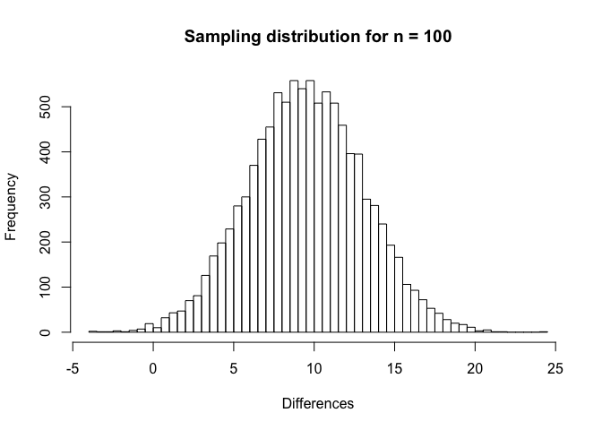
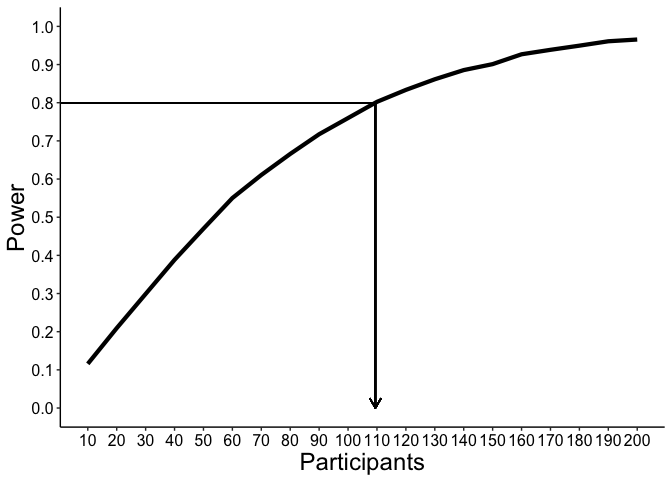
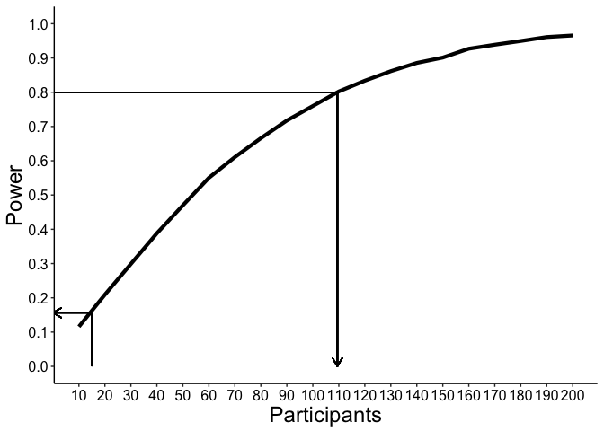

Bordeaux 2019: examples
================
Guillaume A. Rousselet
2019-03-21

-   [Power simulation 1](#power-simulation-1)
    -   [Formula solution](#formula-solution)
    -   [Simulation check](#simulation-check)
    -   [Power curve](#power-curve)
    -   [Replication crisis?](#replication-crisis)
    -   [Simulation](#simulation-1)
-   [Power simulation 2](#power-simulation-2)
    -   [Generate population](#generate-population)
    -   [Pilot experiment](#pilot-experiment)
    -   [Formula solution](#formula-solution-1)
    -   [Simulation check](#simulation-check-1)
    -   [Power curve assuming normal distribution](#power-curve-assuming-normal-distribution)
    -   [Power curve based on simulated population](#power-curve-based-on-simulated-population)
    -   [Replication crisis?](#replication-crisis-1)

``` r
# dependencies
library(pwr)
library(ggplot2)
library(tibble)
library(retimes)
source("./functions.txt")
load("./data/flp_exg_param_interp.RData")
```

``` r
sessionInfo()
```

    ## R version 3.5.2 (2018-12-20)
    ## Platform: x86_64-apple-darwin15.6.0 (64-bit)
    ## Running under: macOS Mojave 10.14.3
    ## 
    ## Matrix products: default
    ## BLAS: /Library/Frameworks/R.framework/Versions/3.5/Resources/lib/libRblas.0.dylib
    ## LAPACK: /Library/Frameworks/R.framework/Versions/3.5/Resources/lib/libRlapack.dylib
    ## 
    ## locale:
    ## [1] en_GB.UTF-8/en_GB.UTF-8/en_GB.UTF-8/C/en_GB.UTF-8/en_GB.UTF-8
    ## 
    ## attached base packages:
    ## [1] stats     graphics  grDevices utils     datasets  methods   base     
    ## 
    ## other attached packages:
    ## [1] retimes_0.1-2 tibble_2.0.1  ggplot2_3.1.0 pwr_1.2-2    
    ## 
    ## loaded via a namespace (and not attached):
    ##  [1] Rcpp_1.0.0       knitr_1.21       magrittr_1.5     tidyselect_0.2.5
    ##  [5] munsell_0.5.0    colorspace_1.4-0 R6_2.4.0         rlang_0.3.1     
    ##  [9] stringr_1.4.0    plyr_1.8.4       dplyr_0.8.0.1    tools_3.5.2     
    ## [13] grid_3.5.2       gtable_0.2.0     xfun_0.4         withr_2.1.2     
    ## [17] htmltools_0.3.6  assertthat_0.2.0 yaml_2.2.0       lazyeval_0.2.1  
    ## [21] digest_0.6.18    crayon_1.3.4     purrr_0.3.0      glue_1.3.0      
    ## [25] evaluate_0.12    rmarkdown_1.11   stringi_1.3.1    compiler_3.5.2  
    ## [29] pillar_1.3.1     scales_1.0.0     pkgconfig_2.0.2

Power simulation 1
==================

We assume a certain difference and sd for one-sample effect.

Formula solution
----------------

``` r
diff <- 1
sd <- 2
res <- pwr.t.test(d = abs(diff)/sd, sig.level = 0.05, power = .80, type = "one.sample")
```

To achieve a power of 80%, we need about 34 participants (rounded up).

Simulation check
----------------

We get the expected power.

``` r
set.seed(21)
# a <- rnorm(20)
# comp.pval(a)
# t.test(a)

nsim <- 10000
n <- 34
mu <- 1
sd <- 2
alpha <- 0.05
mean(apply(matrix(rnorm(nsim * n, mean = mu, sd = sd), nrow = nsim), 1, comp.pval) <= alpha)
```

    ## [1] 0.8041

Power curve
-----------

### Simulation

``` r
nseq <- seq(5,100,5)
pres <- vector(mode = "numeric", length = length(nseq))
for(iter in 1:length(nseq)){
  pres[iter] <- mean(apply(matrix(rnorm(nsim * nseq[iter], mean = mu, sd = sd), nrow = nsim), 1, comp.pval) <= alpha)
}
```

### Illustrate results

``` r
df <- tibble(Participants = nseq, 
             Power = pres)

ggplot(df, aes(x = Participants, y = Power)) + theme_classic() +
  geom_line(size = 1.5) +
  # geom_abline(slope = 0, intercept = 0.80) +
  geom_segment(x = 0, xend = approx(pres, nseq, 0.80)$y, y = 0.8, yend = 0.8) +
  geom_segment(x = approx(pres, nseq, 0.80)$y, xend = approx(pres, nseq, 0.80)$y, 
               y = 0.8, yend = 0,
               arrow = arrow(length = unit(0.3,"cm"))) +
  theme(axis.title.x = element_text(size = 18),
    axis.text = element_text(size = 16, colour = "black"), axis.title.y = element_text(size = 18),
    legend.text = element_text(size = 16),
    legend.title = element_text(size = 18)) +
  scale_x_continuous(breaks = seq(10, 100, 10)) + 
  scale_y_continuous(limits = c(0, 1), breaks = seq(0, 1, .1))
```



Using the approximation technique, we find that to achieve a power of 80%, we need about 34 participants (rounded up). Unsurprisingly we find the same value as in the previous calculation, but it's a good sanity check.

Replication crisis?
-------------------

"Despite its shortcomings for interpreting current data, power can be useful for designing studies and for understanding why replication of “statistical significance” will often fail even under ideal conditions. Studies are often designed or claimed to have 80% power against a key alternative when using a 0.05 significance level, although in execution often have less power due to unanticipated problems such as low subject recruitment. Thus, if the alternative is correct and the actual power of two studies is 80%, the chance that the studies will both show P ≤ 0.05 will at best be only 0.80(0.80) = 64%; furthermore, the chance that one study shows P ≤ 0.05 and the other does not (and thus will be misinterpreted as showing conflicting results) is 2(0.80)0.20 = 32% or about 1 chance in 3. Similar calculations taking account of typical problems suggest that one could anticipate a “replication crisis” even if there were no publication or reporting bias, simply because current design and testing con- ventions treat individual study results as dichotomous outputs of “significant”/“nonsignificant” or “reject”/“accept.”"

Greenland, S., Senn, S.J., Rothman, K.J., Carlin, J.B., Poole, C., Goodman, S.N. & Altman, D.G. (2016) Statistical tests, P values, confidence intervals, and power: a guide to misinterpretations. Eur J Epidemiol, 31, 337-350.

So, for 90% power, the chance that the studies will both show P ≤ 0.05 will at best be only 0.90(0.90) = 81%

Simulation
----------

``` r
set.seed(777)

nsim <- 50000

# experiment 1
pval1 <- apply(matrix(rnorm(nsim * n, mean = mu, sd = sd), nrow = nsim), 1, comp.pval) <= alpha

# experiment 2
pval2 <- apply(matrix(rnorm(nsim * n, mean = mu, sd = sd), nrow = nsim), 1, comp.pval) <= alpha
```

Based on our simulation, if the alternative is correct and the actual power of two studies is 80%, the chance that the studies will both show P ≤ 0.05 will at best be 0.65288.

The chance that one study shows P ≤ 0.05 and the other does not is 0.31004

Power simulation 2
==================

Generate population
-------------------

We use ex-Gaussian parameters from the FLP dataset to generate realistic level 1 reaction time differences in a lexical decision task. For details see this [paper](https://psyarxiv.com/3y54r/). Here we simulate a population with a relatively small effect size.

``` r
set.seed(1)
pop.size <- 100000 # number of participants
load('./data/flp_exg_param_interp.RData')
Np.total <- nrow(exg_param_interp)
nt <- 100 # trials per condition

pop <- vector(mode = "numeric", length = pop.size)
idvec <- sample(Np.total, pop.size, replace = TRUE) # vector of random id
for(P in 1:pop.size){
  # simulate data for the two conditions using nt trials
  w <- rexgauss(nt, 
    mu = exg_param_interp[idvec[P],1,1], 
    sigma = exg_param_interp[idvec[P],2,1], 
    tau = exg_param_interp[idvec[P],3,1])
  nw <- rexgauss(nt, 
    mu = exg_param_interp[idvec[P],1,2], 
    sigma = exg_param_interp[idvec[P],2,2], 
    tau = exg_param_interp[idvec[P],3,2])
  pop[P] <- mean(nw) - mean(w)
}

mean(pop) 
```

    ## [1] 9.531659

``` r
median(pop) 
```

    ## [1] 8.568447

``` r
sd(pop)
```

    ## [1] 35.4361

``` r
mean(pop) / sd(pop)
```

    ## [1] 0.2689816

``` r
skew(pop)
```

    ## [1] 0.1285486

### Illustrate level 1 population

``` r
hist(pop, 50, freq = FALSE, xlim = c(-200, 200), col = "grey90",
     xlab = "Reaction time differences in ms",
     main = paste0("Population values (mean=",round(mean(pop),digits=1),", sd=",round(sd(pop),digits=1),", es=",round(mean(pop)/sd(pop),digits=2),")"))
abline(v = mean(pop), col="red", lwd=5, lty=5)
```



Pilot experiment
----------------

``` r
set.seed(23)
n <- 10
pilot.res <- sample(pop, n, replace = TRUE)
mean(pilot.res)
```

    ## [1] 25.20322

``` r
sd(pilot.res)
```

    ## [1] 31.54691

``` r
mean(pilot.res) / sd(pilot.res)
```

    ## [1] 0.7989123

``` r
hist(pop, 50, freq = FALSE, xlim = c(-200, 200), col = "grey90",
     xlab = "Reaction time differences in ms",
     main = paste0("Population values (mean=",round(mean(pop),digits=1),", sd=",round(sd(pop),digits=1),", es=",round(mean(pop)/sd(pop),digits=2),")"))
abline(v = mean(pop), col="red", lwd=5, lty=5)
abline(v = mean(pilot.res), col="purple", lwd=4, lty=1)
```



Formula solution
----------------

``` r
pilot.diff <- mean(pilot.res)
pilot.sd <- sd(pilot.res)
res <- pwr.t.test(d = abs(pilot.diff)/pilot.sd, sig.level = 0.05, power = .80, type = "one.sample")
```

To achieve a power of 80%, we need about 15 participants (rounded up).

Simulation check
----------------

``` r
set.seed(21)

# check p values are correct:
# a <- rnorm(20)
# comp.pval(a)
# t.test(a)

# Use 10,000 iterations to estimate power - result is a bit larger than 80% because sample size is rounded up:
nsim <- 10000
n <- ceiling(res[[1]])
alpha <- 0.05
mean(apply(matrix(rnorm(nsim * n, mean = pilot.diff, sd = pilot.sd), nrow = nsim), 1, comp.pval) <= alpha)
```

    ## [1] 0.8241

Power curve assuming normal distribution
----------------------------------------

### Simulation

``` r
nseq <- seq(5,30,1)
pres <- vector(mode = "numeric", length = length(nseq))
for(iter in 1:length(nseq)){
  pres[iter] <- mean(apply(matrix(rnorm(nsim * nseq[iter], mean = pilot.diff, sd = pilot.sd), nrow = nsim), 1, comp.pval) <= alpha)
}
```

### Illustrate results

``` r
df <- tibble(Participants = nseq, 
             Power = pres)

ggplot(df, aes(x = Participants, y = Power)) + theme_classic() +
  geom_line(size = 1.5) +
  geom_segment(x = 0, xend = approx(pres, nseq, 0.80)$y, y = 0.8, yend = 0.8) +
  geom_segment(x = approx(pres, nseq, 0.80)$y, xend = approx(pres, nseq, 0.80)$y, 
               y = 0.8, yend = 0,
               arrow = arrow(length = unit(0.3,"cm"))) +
  theme(axis.title.x = element_text(size = 18),
    axis.text = element_text(size = 16, colour = "black"), axis.title.y = element_text(size = 18),
    legend.text = element_text(size = 16),
    legend.title = element_text(size = 18)) +
  scale_x_continuous(breaks = seq(5, 30, 5)) + 
  scale_y_continuous(limits = c(0, 1), breaks = seq(0, 1, .1))
```



Using the approximation technique, we find that to achieve a power of 80%, we need about 15 participants (rounded up). Unsurprisingly we find the same value as in the previous calculation, but it's a good sanity check.

Power curve based on simulated population
-----------------------------------------

### Simulation

``` r
nseq <- seq(10,200,10)
pres <- vector(mode = "numeric", length = length(nseq))
for(iter in 1:length(nseq)){
  pres[iter] <- mean(apply(matrix(sample(pop, nsim * nseq[iter], replace = TRUE), nrow = nsim), 1, comp.pval) <= alpha)
}
```

### Illustrate sampling distribution for n = 10

``` r
hist(apply(matrix(sample(pop, nsim * 10, replace = TRUE), nrow = nsim), 1, mean), 
      50,
      xlab = "Differences",
      main = "Sampling distribution for n = 10")
```



### Illustrate sampling distribution for n = 100

``` r
hist(apply(matrix(sample(pop, nsim * 100, replace = TRUE), nrow = nsim), 1, mean), 
      50,
      xlab = "Differences",
      main = "Sampling distribution for n = 100")
```



### Illustrate results

``` r
df <- tibble(Participants = nseq, 
             Power = pres)

ggplot(df, aes(x = Participants, y = Power)) + theme_classic() +
  geom_line(size = 1.5) +
geom_segment(x = 0, xend = approx(pres, nseq, 0.80)$y, y = 0.8, yend = 0.8) +
  geom_segment(x = approx(pres, nseq, 0.80)$y, xend = approx(pres, nseq, 0.80)$y, 
               y = 0.8, yend = 0,
               arrow = arrow(length = unit(0.3,"cm"))) +
  theme(axis.title.x = element_text(size = 18),
    axis.text = element_text(size = 12, colour = "black"), axis.title.y = element_text(size = 18),
    legend.text = element_text(size = 16),
    legend.title = element_text(size = 18)) +
  scale_x_continuous(breaks = seq(10, 200, 10)) + 
  scale_y_continuous(limits = c(0, 1), breaks = seq(0, 1, .1))
```



Using the approximation technique, we find that to achieve a power of 80%, we need about 110 participants (rounded up).

Using the pilot study, we set n = 15, achieving a power of 0.16.

### Illustrate real power

``` r
df <- tibble(Participants = nseq, 
             Power = pres)

ggplot(df, aes(x = Participants, y = Power)) + theme_classic() +
  geom_line(size = 1.5) +
  # real power
geom_segment(x = 0, xend = approx(pres, nseq, 0.80)$y, y = 0.8, yend = 0.8) +
  geom_segment(x = approx(pres, nseq, 0.80)$y, xend = approx(pres, nseq, 0.80)$y, 
               y = 0.8, yend = 0,
               arrow = arrow(length = unit(0.3,"cm"))) +
  # achieved power
  geom_segment(x = 0, xend = ceiling(res[[1]]),
               y = approx(nseq, pres, res[[1]])$y, yend = approx(nseq, pres, res[[1]])$y,
               arrow = arrow(length = unit(0.3,"cm"), ends = "first")) +
  geom_segment(y = approx(nseq, pres, res[[1]])$y, yend = 0, 
               x = ceiling(res[[1]]), xend = ceiling(res[[1]])) +
  theme(axis.title.x = element_text(size = 18),
    axis.text = element_text(size = 12, colour = "black"), axis.title.y = element_text(size = 18),
    legend.text = element_text(size = 16),
    legend.title = element_text(size = 18)) +
  scale_x_continuous(breaks = seq(10, 200, 10)) + 
  scale_y_continuous(limits = c(0, 1), breaks = seq(0, 1, .1))
```



Replication crisis?
-------------------

### Simulation

``` r
set.seed(777)

nsim <- 50000
n <- ceiling(approx(pres, nseq, 0.80)$y)

# experiment 1
pval1 <- apply(matrix(sample(pop, nsim * n, replace = TRUE), nrow = nsim), 1, comp.pval) <= alpha

# experiment 2
pval2 <- apply(matrix(sample(pop, nsim * n, replace = TRUE), nrow = nsim), 1, comp.pval) <= alpha
```

Based on our simulation, if the alternative is correct and the actual power of two studies is 80%, the chance that the studies will both show P ≤ 0.05 will at best be 0.6448.

The chance that one study shows P ≤ 0.05 and the other does not is 0.31606
